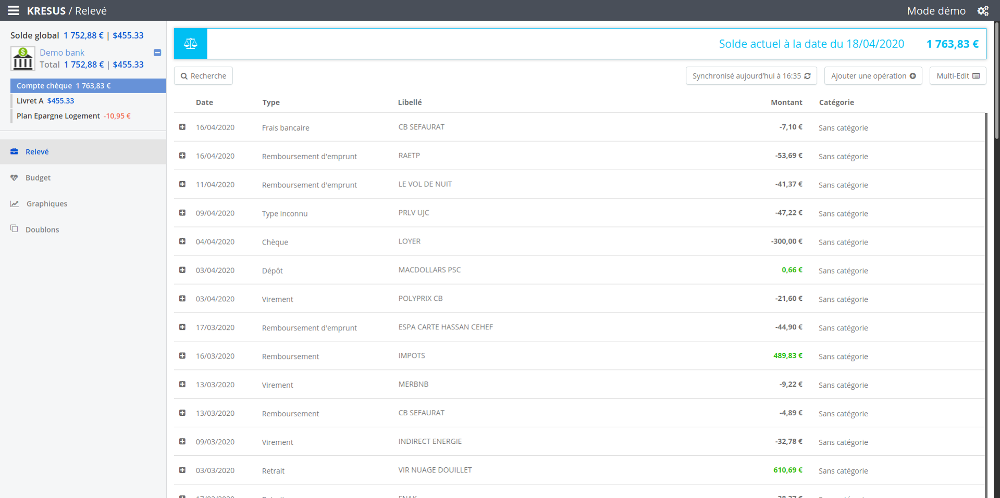

<!--
N.B.: This README was automatically generated by https://github.com/YunoHost/apps/tree/master/tools/readme_generator
It shall NOT be edited by hand.
-->

# Kresus for YunoHost

[](https://dash.yunohost.org/appci/app/kresus)  

[](https://install-app.yunohost.org/?app=kresus)

*[Lire ce readme en français.](./README_fr.md)*

> *This package allows you to install Kresus quickly and simply on a YunoHost server.
If you don't have YunoHost, please consult [the guide](https://yunohost.org/#/install) to learn how to install it.*

## Overview

Kresus is an open-source libre self-hosted personal finance manager. It allows you to safely track your banking history, check your overall balance and know exactly how you are spending money using categories!


**Shipped version:** 0.20.1~ynh3

**Demo:** https://kresus.org/en/demo.html

## Screenshots



## Documentation and resources

* Official app website: <https://kresus.org>
* Official admin documentation: <https://kresus.org/en/doc.html>
* Upstream app code repository: <https://framagit.org/kresusapp/kresus>
* YunoHost Store: <https://apps.yunohost.org/app/kresus>
* Report a bug: <https://github.com/YunoHost-Apps/kresus_ynh/issues>

## Developer info

Please send your pull request to the [testing branch](https://github.com/YunoHost-Apps/kresus_ynh/tree/testing).

To try the testing branch, please proceed like that.

``` bash
sudo yunohost app install https://github.com/YunoHost-Apps/kresus_ynh/tree/testing --debug
or
sudo yunohost app upgrade kresus -u https://github.com/YunoHost-Apps/kresus_ynh/tree/testing --debug
```

**More info regarding app packaging:** <https://yunohost.org/packaging_apps>